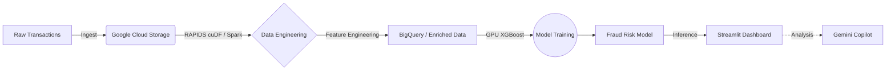

# 🛡️ FraudLens – Accelerated Fraud Detection Intelligence

[](https://fraudlens-2aayf5pr9cbzxabam44mux.streamlit.app/)

<div align="center">
  
</div>

<p align="center">
  <strong>A real-time data-intelligence and decision-support tool for financial risk analysts.</strong>
</p>

<p align="center">
  <a href="#overview">Overview</a> •
  <a href="#key-features">Key Features</a> •
  <a href="#architecture">Architecture</a> •
  <a href="#quickstart">Quickstart</a> •
  <a href="#deployment">Deployment</a>
</p>

---

## 📖 Overview

FraudLens is an enterprise-grade prototype demonstrating how to combine **NVIDIA GPU Acceleration** with **Google Cloud Platform (GCP)** to achieve ultra-fast data intelligence. Designed for financial risk analysts, it ingests transaction data, performs machine learning inferences to predict fraud, and visualizes the results through a high-performance, interactive Streamlit dashboard.

The project highlights **massive speedups** (up to 50x) in data processing and model training by utilizing NVIDIA RAPIDS and GPU-accelerated XGBoost over traditional CPU-based pipelines.

## ✨ Key Features

- 🚀 **NVIDIA Acceleration:** Uses RAPIDS (`cudf.pandas`) for blazing-fast ETL operations and GPU-accelerated XGBoost for model training and inference.
- ☁️ **Google Cloud Native:** Integrates seamlessly with Cloud Storage, BigQuery, GKE, and Dataproc Spark RAPIDS.
- 🧠 **Gemini Copilot Integration:** Built-in AI assistant to help analysts quickly interpret complex fraud signals and take immediate action.
- 📊 **Interactive Dashboard:** A sleek, glassmorphic dark-mode UI built with Streamlit, featuring live triage panels, risk simulators, and real-time GPU vs. CPU benchmarking.
- ⚡ **End-to-End Pipeline:** Includes everything from synthetic data generation to distributed cloud deployment configs.

## 🏗️ Architecture



## 🚀 Quickstart (Local Development)

### 1. Prerequisites
- Python 3.10+
- NVIDIA GPU (optional for running, but required for GPU benchmarking)
- Git

### 2. Installation
Clone the repository and install dependencies:
```bash
git clone https://github.com/reet-9944/FraudLens.git
cd FraudLens
pip install -r requirements.txt
```

### 3. Generate Synthetic Data
Create a local dataset of transactions (or place your own CSV in `../data/`):
```bash
python src/data_generator.py --rows 100000
```

### 4. Run the Pipeline
Train the model and run the CPU vs. GPU benchmark:
```bash
python src/model_training.py
python src/benchmarking.py
```

### 5. Launch the Dashboard
Fire up the Streamlit UI:
```bash
streamlit run app/dashboard.py
```
*Navigate to [http://localhost:8501](http://localhost:8501) in your browser.*

## ☁️ Live Demo (Streamlit Cloud)

The application is currently live and deployed on Streamlit Community Cloud.
**👉 Access the live application here:** [https://fraudlens-2aayf5pr9cbzxabam44mux.streamlit.app/](https://fraudlens-2aayf5pr9cbzxabam44mux.streamlit.app/)

## ☁️ Deployment (Google Cloud)

FraudLens is designed to be easily deployed on Google Kubernetes Engine (GKE) with NVIDIA GPUs.

### 1. Build and Push the Docker Container
```bash
docker build -t gcr.io/fraudlens-501610/fraudlens:latest .
docker push gcr.io/fraudlens-501610/fraudlens:latest
```

### 2. Provision a GKE Cluster (with NVIDIA L4 GPUs)
```bash
gcloud container clusters create fraudlens-gke \
    --zone us-central1-a \
    --accelerator type=nvidia-l4,count=1 \
    --machine-type n1-standard-4 \
    --enable-stackdriver-kubernetes
```

### 3. Deploy the Application
```bash
kubectl apply -f k8s_deployment.yaml
```
Access the application using the External IP assigned by the LoadBalancer:
```bash
kubectl get svc fraudlens
```

## 📁 Project Structure

```text
FraudLens/
├── app/                  # Streamlit dashboard & UI components
│   └── dashboard.py
├── cloud_function/       # Serverless endpoints for automation
│   └── main.py
├── src/                  # Core pipeline modules
│   ├── benchmarking.py   # CPU vs GPU performance metrics
│   ├── data_generator.py # Synthetic transaction generation
│   ├── gcp_pipeline.py   # GCP specific integrations
│   └── model_training.py # XGBoost model training logic
├── data/                 # Local directory for datasets & models (git-ignored)
├── Dockerfile            # Container definition for GKE / Cloud Run
├── k8s_deployment.yaml   # Kubernetes deployment manifests
├── requirements.txt      # Python dependencies
└── README.md             # Project documentation
```

## 📄 License
This project is licensed under the MIT License. Feel free to fork, extend, and use it in your own applications!